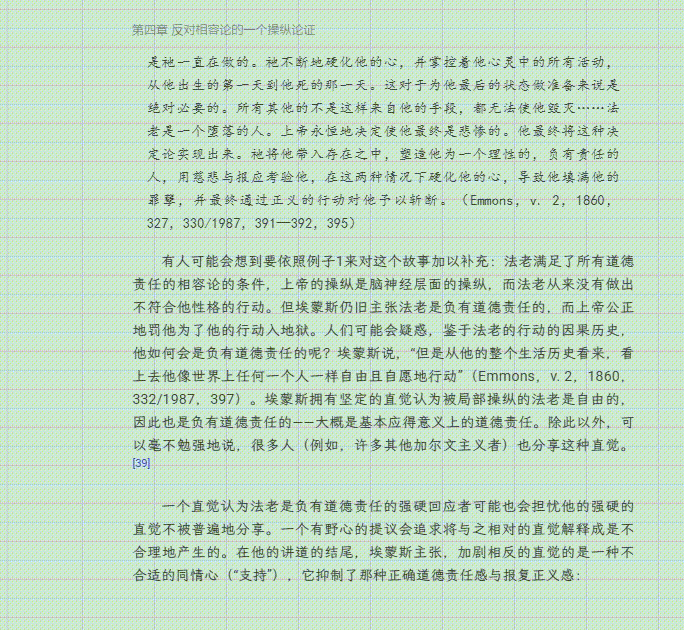

# Readest 透明阅读增强版

本项目是在原作者 [Readest](https://github.com/readest/readest) 开源作品的基础上进行的个人修改与功能整合。

Readest 的核心阅读能力、界面框架和跨平台基础均来自原项目；本分支主要针对 Windows 上的透明阅读与轻量化窗口操作进行增强。感谢 Readest 原作者及所有贡献者的工作。

> 这是社区维护的非官方版本，与 Readest 官方项目无隶属关系。完整的原版功能介绍和文档请查看 [Readest 官方仓库](https://github.com/readest/readest)。

## 下载

- Windows x64 安装包：[v0.9.78-transparent.2](https://github.com/jezian1/readest/releases/tag/v0.9.78-transparent.2)
- 安装文件：`Readest_0.9.78_x64-setup.exe`
- SHA-256：`F6AE2D4CF34A3660DE455B0A4D0B4E7FDD8871E2299275D896DFDBCC51BD1354`

该安装包没有数字签名，Windows SmartScreen 可能显示安全提示。建议下载后先核对 SHA-256 校验值。

## 效果演示

<p align="center">
  
  
</p>

## 本分支新增与整合的功能

### 透明阅读

- 支持开启或关闭透明阅读。
- 支持背景透明和整体融合两种显示效果。
- 可分别调整背景、整体内容和文字不透明度。
- 透明状态下保留文字选择工具栏的不透明显示，方便继续使用标注、复制和查询功能。
- 章节目录、笔记、进度和字体浮层在透明阅读时保持清晰可读。

### 窗口控制

- 在阅读界面快速开启或关闭窗口置顶。
- 支持“鼠标移入显示、移出隐藏”的隐身模式。
- 隐身模式依赖窗口置顶：取消置顶时会自动取消隐身，未开启置顶时不能启用隐身。
- 可选择在移出隐身时保留顶部章节页眉。
- 修复透明状态下顶部按钮无法点击、标题栏区域无法拖动等交互问题。

### 其他调整

- 关闭启动时的自动更新检查和更新提示。
- 保留 Readest 原有阅读、书库、标注、翻译和文本转语音等能力。

## 当前测试范围

本分支主要在 Windows x64 桌面端进行开发和测试，其他桌面或移动平台尚未完整验证。

已完成的代码检查：

- TypeScript 类型检查通过。
- 51 个自动化测试通过。
- 4 个上游集成测试按原项目配置跳过。

## 本地运行

请先安装 Node.js、pnpm、Rust 和 Tauri 在 Windows 上需要的相关工具链。

```powershell
git clone https://github.com/jezian1/readest.git
cd readest
pnpm install
pnpm tauri dev
```

更完整的开发环境要求请参考 [Readest 原项目说明](https://github.com/readest/readest) 和 [Tauri 官方文档](https://v2.tauri.app/start/prerequisites/)。

## 与原项目的关系

- 上游项目：[readest/readest](https://github.com/readest/readest)
- 当前增强分支：`transparent-reader`
- 本分支会尽量保留原项目结构，只针对透明阅读相关需求进行修改和整合。
- 原项目后续更新不会自动同步到本分支，需要单独评估和合并。

## 许可证与致谢

本项目沿用 Readest 的 [GNU Affero General Public License v3.0](LICENSE)。

修改和再发布本项目时，请遵守 AGPL-3.0，并保留原项目的许可证、版权和来源说明。Readest 名称、图标及原项目内容归各自权利人所有。

特别感谢：

- [Readest](https://github.com/readest/readest) 原作者与贡献者。
- [Foliate](https://github.com/johnfactotum/foliate) 项目。
- Tauri、Next.js 及其他开源依赖的维护者。
